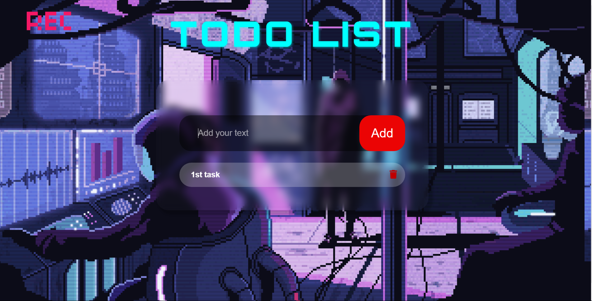

# To-Do List App

A simple To-Do list web application built using HTML, CSS, and JavaScript. The app allows users to add, remove, and manage tasks, with data stored in the browser's local storage, so the tasks persist even after the page is refreshed or reopened.

## Features

- Add, remove, and edit tasks.
- Local storage support to save tasks across browser sessions.
- Responsive design for mobile and desktop.
- 100 character limit per task.

## Demo

You can access a live demo of the app [here](https://b1ttr0zki.github.io/ToDo-List/).
